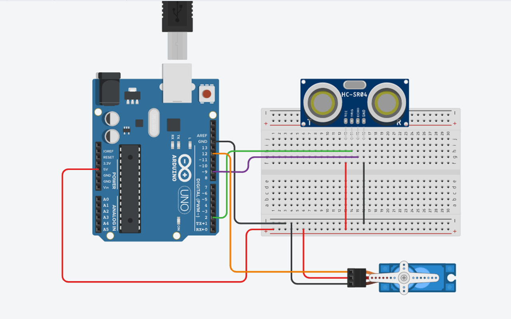

# Arduino Radar System with Ultrasonic Sensor & Processing Visualization

This repository contains the code and setup for an Arduino-powered radar system that uses an ultrasonic sensor (like HC-SR04) to detect objects and displays a visual representation of the radar scan using the Processing IDE. The system involves two main components:
1. **Arduino IDE**: Controls the ultrasonic sensor and servo motor.
2. **Processing IDE**: Creates a visual radar display to represent detected objects in real-time.

## Features

- **Ultrasonic Sensor for Distance Measurement**: Measures distance to objects using an ultrasonic sensor (e.g., HC-SR04).
- **Servo Motor**: The radar system rotates a servo to scan different angles.
- **Arduino-Controlled System**: Arduino handles sensor data collection and sends it to the Processing IDE.
- **Real-Time Radar Visualization**: Uses Processing to create a graphical representation of the radar system's scan.

## Hardware Required

- Arduino Uno (or compatible Arduino board)
- Ultrasonic Distance Sensor (e.g., HC-SR04)
- Servo Motor (e.g., SG90)
- Breadboard and Jumper Wires
- Power Supply (USB or battery)

## Software Required

- [Arduino IDE](https://www.arduino.cc/en/software)
- [Processing IDE](https://processing.org/download/)

## Circuit Diagram

